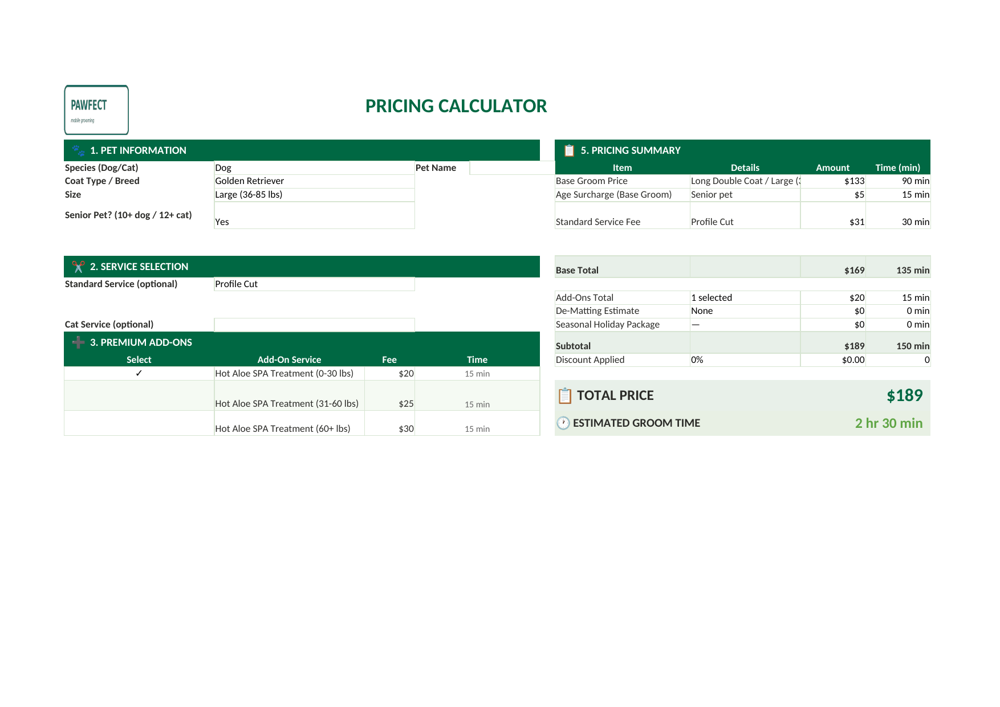
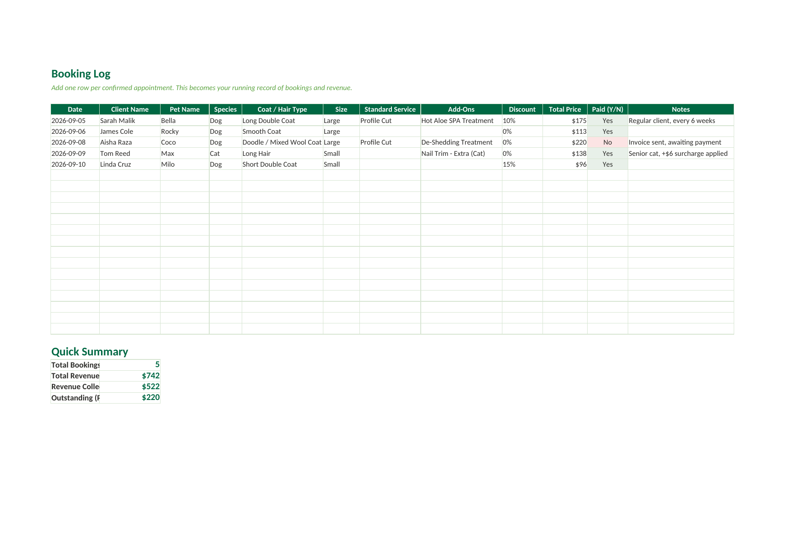
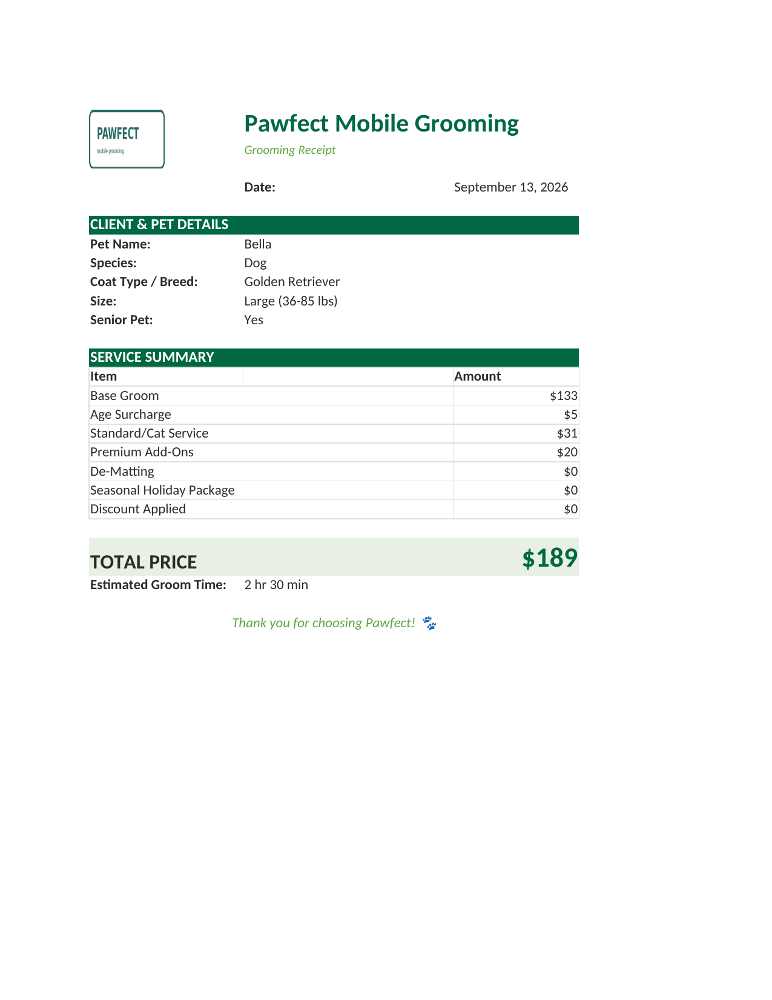

# 🐾 Pawfect Mobile Grooming — Dynamic Pricing Calculator

A fully automated Excel pricing and booking system built for a mobile pet
grooming business, handling dogs and cats with different coat/hair types,
sizes, add-on services, safety-critical grooming rules, discounts, and
one-click booking automation via VBA.

> **Note:** This is a sanitized demo version built for portfolio purposes.
> Brand name, logo, and pricing figures are fictional/placeholder — the
> underlying formulas, structure, and automation logic are the real,
> unmodified system delivered to the client.

---

## What This Solves

A small business owner needed to quote prices to customers in real time
based on a dozen interacting variables — species, coat type, breed, size,
age, add-ons, seasonal specials, and discounts — without hiring a developer
or paying for custom software. This project delivers that entirely inside
Excel, using formulas, data validation, and VBA — no external tools, no
subscriptions, fully owned and editable by the business owner.

## Key Features

- **Dynamic multiplier-based pricing** — base price × coat-type multiplier ×
  size multiplier, calculated live as the user selects options
- **Breed-aware auto-detection** — select a dog breed by name and the
  correct coat type is applied automatically from a 197-breed reference
  table; or skip straight to a coat type if the breed is unknown
- **Species-specific logic** — dogs and cats have different services,
  different base prices, and mutually exclusive option sets, enforced with
  live validation warnings
- **Safety-critical grooming rules** — automatically warns against unsafe
  services for certain coat types (e.g. shaving double-coated breeds),
  including a breed-specific hard-stop warning
- **Live time estimation** — every selection (age, add-ons, services)
  contributes to an estimated groom time, converted automatically to
  hours/minutes
- **One-click booking automation (VBA)** — a macro reads the current quote
  and appends it to a running booking log, with duplicate-proof row
  detection and automatic field clearing for the next customer
- **One-click PDF receipts (VBA)** — generates a branded, customer-ready
  PDF receipt with a smart filename, independent of the booking log
- **Password-protected formulas** — the working calculator and log are
  locked against accidental edits, while the pricing rules themselves stay
  fully editable by the business owner with no password required
- **Built-in documentation** — a dedicated "How to Use" tab covering every
  feature, written for a non-technical end user

## Screenshots

### Pricing Calculator


### Automated Booking Log


### Auto-Generated Receipt


## File Structure

```
├── Pawfect_Pricing_Calculator.xlsx    # Main workbook (5 tabs)
├── vba/
│   ├── SaveQuoteToLog.bas             # Booking automation macro
│   └── ExportReceiptPDF.bas           # PDF export macro
└── screenshots/
```

### Workbook Tabs
| Tab | Purpose |
|---|---|
| **How to Use** | Full instructions for the end user, including exactly where to edit prices |
| **Pricing Calculator** | The working quote tool — all dropdowns, live totals, safety warnings |
| **Receipt** | Auto-generated, customer-facing summary of the current quote |
| **Booking Log** | Running record of all bookings, with automatic revenue summary |
| **Data** | All pricing rules, multipliers, and reference tables — the only sheet meant to be edited directly |

## Built With

- **Excel formulas**: nested `IF`, `INDEX`/`MATCH`, `SUMPRODUCT`, named
  ranges for cross-sheet dropdown lists
- **Data Validation**: dependent and lenient (free-text-allowed) dropdowns
- **Sheet Protection**: cell-level locking with a password, while keeping
  the pricing-rules sheet fully open for the business owner
- **VBA**: two macros (see `/vba`) — one for booking automation, one for
  PDF generation — including sheet protection handling, bounded-range
  row-search logic, and dynamic file-naming with character sanitization

## Notable Engineering Decisions

- **Cross-sheet dropdown lists on a protected sheet can silently fail** in
  Excel unless sourced from a named range rather than a direct cell
  reference — a real bug caught during testing and documented as a fix.
- **A single input field handles both "pick a coat type" and "pick a
  breed"** by checking the selected value against a breed lookup table
  first, falling back to treating it as a literal coat type otherwise —
  avoiding two separate, potentially-contradicting input fields.
- **VBA macros must explicitly unprotect/reprotect sheets** they write to;
  Excel does not exempt macros from sheet protection just because the code
  is running.

## About the VBA Files

The `.xlsx` format cannot store macros — Excel requires the macro-enabled
`.xlsm` format for that, and macros must be added directly inside Excel's
own VBA editor (they cannot be reliably embedded by external tools). The
`/vba` folder contains the exact, tested macro code as reference — copy
either file's contents into the VBA editor (Alt+F11 → Insert → Module) to
enable that feature in your own copy.

---

*Built as a freelance project — from initial requirements gathering through
multiple rounds of client feedback, testing, and iteration.*
